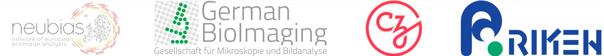
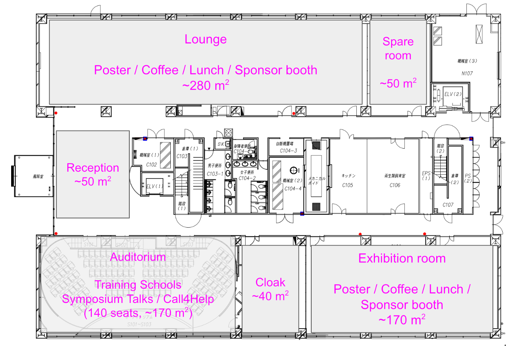

# GloBIAS Bioimage Analysis Training School 2025
Program and links to the material for the GloBIAS Training School 2025, Kobe, Japan.

<p align="center">
  
</p>

<b>26-29 October 2025, Kobe, Japan </b><br>

Organizers:
<b> <p> 
- Rocco D'Antuono - The Francis Crick Institute, UK 
- Ana Stojiljkovic - University of Bern, CH
- Kagayaki Kato - National Institute for Basic Biology, JP
- Shynia Komoto - Okinawa Institute of Science and Technology, JP
</p></b>

 This training is developed and delivered by <a href="https://github.com/RoccoDAnt">Rocco D’Antuono</a> (The Francis Crick Institute, London, UK), <a href="https://github.com/StojiljkovicVetAna">Ana Stojiljkovic</a> (University of Bern, CH), <a href="https://www.nibb.ac.jp/en/sections/members/kato_kagayaki.html">Kagayaki Kato</a> (NIBB, Okazaki, JP), <a href="https://www.oist.jp/image/oist-imaging-section">Shinya Komoto</a> (OIST, Okinawa, JP), <a href="https://github.com/leclercsimon74">Simon Leclerc</a> (University of Gothenburg, SE), <a href="https://github.com/elnazfazeli">Elnaz Fazeli</a> (University of Helsinki, FI), <a href="https://github.com/sebgoti">Sebastian Gonzalez Tirado</a> (Heidelberg University, DE), <a href="https://github.com/bpavie">Benjamin Pavie</a> (VIB - Leuven/Ghent, BE), <a href="https://github.com/NickCondon">Nicholas Condon</a> (University of Queensland, AU), <a href="https://github.com/tatianawoller">Tatiana Woller</a> (VIB - Leuven, BE), <a href="https://github.com/sunyi000">Yi Sun</a> (EMBL, Heidelberg, DE), <a href="https://github.com/k-dominik">Dominik Kutra</a> (EMBL, Heidelberg, DE).

## Venue
The Training School will be held at the RIKEN Kobe Campus, in the **RIKEN Center for Biosystems Dynamics Research (BDR)**

**Address**<br>
Building C<br>
2-2-3 Minatojima-minamimachi Chou-ku,<br>
Kobe, Hyogo 650-0047, Japan

**Access**<br>
https://www.kobe.riken.jp/en/access/west/

**Rooms**<br>
Day 1-3: Lounge<br>
Day 4: Auditorium
<p align="center">
  
</p>

## Programme:
### Day 1
Sunday, October 26, 2025
#### Introduction & Basics of Image Analysis and Parallel Computing

|<b>Time</b>| <b>Topic</b>| <b>Trainers</b>|
|---| ---| ---|
|10:00-10:20| Registration | *Local organizers*|
|10:20-10:30| Welcome | *Rocco D'Antuono*|
|10:30–11:00| Bioimage fundamentals | *Elnaz Fazeli<br>Simon Leclerc* | 
|11:00-11:30| Introduction to python tools| *Kagayaki Kato*|
|11:30-12:00| Basic image processing workflow| *Rocco D'Antuono*|
|12:00-13:00| Lunch|
|13:00-13:45| File format for parallel computing | *Dominik Kutra<br>Benjamin Pavie*|
|13:45-15:00| Slurm - Job scheduling| *Yi Sun*|
|15:00-15:30| Make teams and decide on projects | *All trainers*|
|15:00-15:30| <em>Coffee break</em>|
|15:30-18:00| Work on participants' projects | *All trainers*|
|18:00-21:00| <em>Welcome Dinner</em>|


### Day 2
Monday, October 27, 2025
#### High Performance Computing (HPC)

|<b>Time</b>| <b>Topic</b>| <b>Trainers</b>|
|---| ---| ---|
|09:00-10:00| Workflow management and containers| *Sebastian Gonzalez Tirado<br>Benjamin Pavie*|
|10:00-10:30| Hands-on installing Docker | *All trainers*|
|10:30-11:00| <em>Coffee break</em> |
|11:00-11:45| Resource allocation on HPC| *Nicholas Condon<br>Tatiana Woller*|
|11:45-12:00| Check on projects progress| *All trainers*|
|12:00-13:00| <em>Lunch</em> |
|13:00-15:00| Hands-on HPC - BARD part 1| *All trainers*|
|15:00-15:30| Check on participants' projects| *All trainers*|
|15:30-16:00| <em>Coffee break</em>|
|16:00-16:45| Use case with Nextflow| *Sebastian Gonzalez Tirado*|
|16:45-18:00| <em>Dinner (own arrangements)</em>| *All trainers*|


### Day 3
Tuesday, October 28, 2025
#### Machine Learning

|<b>Time</b>| <b>Topic</b>| <b>Trainers</b>|
|---| ---| ---|
|09:00-09:30| Introduction to Machine Learning| *Dominik Kutra<br>Ana Stojiljkovic*|
|09:30-10:30| Hands-on Machine Learning | *All trainers*|
|10:30-11:00| <em>Coffee break</em> |
|11:00-12:00| Hands-on BARD part 2| *Dominik Kutra<br>Benjamin Pavie*|
|12:00-13:00| <em>Lunch</em> |
|13:00-15:00| Work on participants' projects| *All trainers*|
|15:00-15:30| <em>Prepare to move</em>|
|**15:30**| **Pick up** <p> Excursion (sake brewery tour) & dinner at Shushinkan|


### Day 4
Wednesday, October 29, 2025
#### 3D Segmentation and figure preparation

|<b>Time</b>| <b>Topic</b>| <b>Trainers</b>|
|---| ---| ---|
|09:00-10:30| Project presentations|  *Rocco D'Antuono<br>Ana Stojiljkovic*|
|10:30-11:00| <em>Coffee break</em>|
|11:00-11:45| Project presentations| *Rocco D'Antuono<br>Ana Stojiljkovic*|
|11:45-12:00| Closing| *Rocco D'Antuono*|

--------------------------
# Course Material
## Day 1

### Bioimage Fundamentals

[Slides](https://docs.google.com/presentation/d/1Rhmka7j8xiXp9olVy0BGPaGhkABWNHGKkYwlzyvxjvM/edit?slide=id.g368e348cd0a_0_24#slide=id.g368e348cd0a_0_24)

### Introduction to python tools  
[Slides](https://docs.google.com/presentation/d/1fdT-K91YZCBEg9g08dtZdkmdQ-bLnC7alu8X_8M6CE8/edit?usp=sharing)  
[Jupyter notebook (ipynb)](https://drive.google.com/file/d/1j6pt_FBnS6iEjwjm5rpEXdtoIBMuJ-Kn/view?usp=sharing)  

### Introduction to napari
[Basic image analysis workflows with python and napari - Rocco D'Antuono](https://docs.google.com/presentation/d/1R0YCoPA00VmHDshARoe34q0s8c942ptFvhIfCR73FzM/edit?usp=sharing)

### File format for parallel computing : OME-ZARR
[Slides](https://docs.google.com/presentation/d/1ieZRd0A2DPasgIpbOUJwsdxczG-aem60/edit?usp=sharing&ouid=101461861887516527432&rtpof=true&sd=true)

### Introduction to cluster and Slurm
[Hands-on instructions](https://globias-tutorial.embl.de)

## Day 2

### Workflow management and containers : Docker
[Slides](https://docs.google.com/presentation/d/1euJewnbw5fT2awcPtaiSgiDLyvMTZB8w/edit?usp=sharing&ouid=115402527201314058038&rtpof=true&sd=true)

### Introduction to BARD

BARD access : https://bard-external.embl.de

- [Resource Allocation on HPC](https://docs.google.com/presentation/d/1jR8FzRQyQRIMw1s-pEHv8qsU52RKztICLCHleTT2Xo8/edit?usp=sharing) 🖺
- [BARD Introduction](https://s.embl.org/bard-intro) 🖺
- [Fiji On BARD](https://docs.google.com/presentation/d/1ULXJIg8i4-SUOLAlgE403gtXDg-HGEt8/edit?usp=sharing&ouid=111745350217445405289&rtpof=true&sd=true) 🖺
- [QuPath on BARD](https://docs.google.com/presentation/d/1oF059OdUEqYuxzUMgAd52EX-WaSJIYuJ/edit?usp=sharing&ouid=115402527201314058038&rtpof=true&sd=true) 🖺
- [CellPose on BARD](https://docs.google.com/presentation/d/1TU4pxWBmtKULfXzS5WUgbVsaYOwSKvVE/edit?usp=sharing&ouid=115402527201314058038&rtpof=true&sd=true) 🖺

### Use case with Nextflow

[Slides](./presentations/GloBIAS_2025_Nextflow4BioimageAnalysis.pdf)

## Day 3
Introduction to Machine Learning - Slides<br>
https://docs.google.com/presentation/d/1OZXYkEtDYfUS_4uukWuoOEJ8TlXz46cKSFr2pi0M9Xk/edit?usp=sharing

--------------------------
# Preparation for the course
## Installation instructions

During the hands-on sessions we will extensively try and retry the software installation with conda environments, however to gain some practice and proceed smoothly to more interesting topics, please proceed with the following homework before the workshop

#### 1. Install Anaconda Navigator
#### 2. Install napari within conda prompt

Please make sure to have at least 10-15 GB free on the pc you will bring with you for participating in the workshop. Please let us know well in advance if you cannot bring a pc with you, we might be able to get a loan, however this is not guaranteed and you might risk to have no pc to follow along.

#### 1. Install Anaconda Navigator
This is a method that use the graphical user interface to download and install Anaconda Navigator.
Please visit https://docs.anaconda.com/ and click on the green button "Download Anaconda". You will be asked to provide an email address and will receive the link to the download page, where you will choose the version for your OS.

Before installing Anaconda Navigator, please identify a folder in your computer over which you have full permission of read and write file: we will create and update many times conda environments, this means that the software will install and remove files all the times.

#### 2. Install napari within conda prompt
The successful installation of Anaconda Navigator will make available an app called "Anaconda prompt". Thsi is the terminal that we will use to create and work with conda environments.

a) Update conda, by typing the following line and pressing Enter.
```
conda update -n base -c conda-forge conda
```

b) create a new environment with a meaningful name: substitute with your choice the string "mymeaningfulname". E.g. "kobe-workshop-env". Please do not simplify with "napari-env", as half of the tutorial use that and you might risk to overwrite a previous environment which contain packages used in previous analyses.

```
conda create -n mymeaningfulname-env python=3.12
```

c) activate the new environment

```
conda activate mymeaningfulname-env
```
You should notice a change in the prompt where the name base at the beginning of the prompt has been changed to "mymeaningfulname-env". This confirms that it is safe to install new packages, as you are not altering the base environment (safe choice is not touch "base").

d) install napari

```
conda install -c conda-forge napari pyqt
```

e) check that napari opens
At this point, if no error appears in the terminal as result of the operations above, you are ready to open napari executing
```
napari
```
##### Create a conda environment with a recipe
If a working environment cannot be created through the commands above, the following recipe can be used to create an environment with napari

a) Download the file [kobe2025-napari-env.yml](https://github.com/GloBIAS-BioimageAnalysts/GloBIAS_Training_School_2025_Kobe_Japan/tree/main/envs/kobe2025-napari-env.yml) into a local folder

b) use the Anaconda prompt to navigate to the local folder and execute
```
conda env create -f kobe2025-napari-env.yml
```
This should create an environment with the same name of the .yml file unless otherwise specified.

c) check that napari opens

At this point, if no error appears in the terminal as result of the operations above, you are ready to open napari executing
```
napari
```
